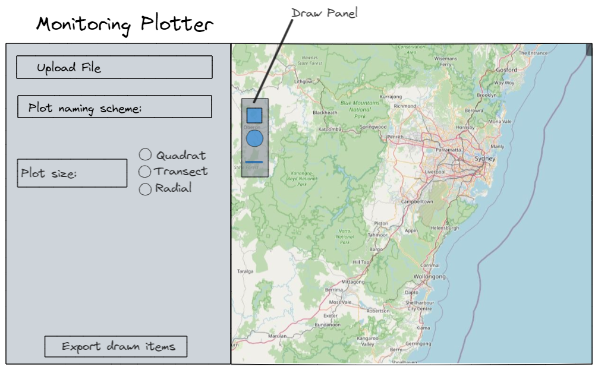

# Monitoring Plotter

Monitoring Plotter is a shiny application for designing ecological surveys in a leaflet environment. The aim is for users to upload files and draw their own management sites, with the ability to randomly generate or place plots of a defined size (e.g. 50x20m). Then, simply download in their required format.

Upon entry of plot size, leaflet.draw tools will be restricted to size entered. Currently requires extending functionalities of leaflet.draw and recompiling into the R package, Leaflet.extras.
